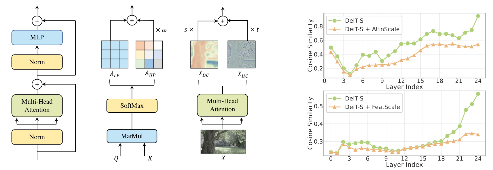

# Anti-Oversmoothing in Deep Vision Transformers via the Fourier Domain Analysis: From Theory to Practice

[](https://opensource.org/licenses/MIT)

The official implementation of ICLR 2022 paper [Anti-Oversmoothing in Deep Vision Transformers via the Fourier Domain Analysis: From Theory to Practice](https://openreview.net/forum?id=O476oWmiNNp).

Peihao Wang, Wenqing Zheng, Tianlong Chen, Zhangyang (Atlas) Wang

This repository is built based on DeiT and CaiT [official repository](https://github.com/facebookresearch/deit).

## Introduction

Vision Transformer (ViT) has recently demonstrated promise in computer vision problems. However, unlike Convolutional Neural Networks (CNN), it is known that the performance of ViT saturates quickly with depth increasing, due to the observed attention collapse or patch uniformity. Despite a couple of empirical solutions, a rigorous framework studying on this scalability issue remains elusive. In this paper, we first establish a  rigorous theory framework to analyze ViT features from the Fourier spectrum domain. We show that the self-attention mechanism inherently amounts to a low-pass filter, which indicates when ViT scales up its depth, excessive low-pass filtering will cause feature maps to only preserve their Direct-Current (DC) component. We then propose two straightforward yet effective techniques to mitigate the undesirable low-pass limitation. The first technique, termed AttnScale, decomposes a self-attention block into low-pass and high-pass components, then rescales and combines these two filters to produce an all-pass self-attention matrix. The second technique, termed FeatScale, re-weights feature maps on separate frequency bands to amplify the high-frequency signals. Both techniques are efficient and hyperparameter-free, while effectively overcoming relevant ViT training artifacts such as attention collapse and patch uniformity. By seamlessly plugging in our techniques to multiple ViT variants, we demonstrate that they consistently help ViTs benefit from deeper architectures, bringing up to 1.1% performance gains "for free" (e.g., with little parameter overhead).



## Getting Started

### Dependency

First of all, clone our repository locally:

```
git clone https://github.com/VITA-Group/ViT-Anti-Oversmoothing.git
```

Then, install the following Python libraries which are required to run our code:

```
pytorch 1.7.0
cudatoolkit 11.0
torchvision 0.8.0
timm 0.4.12
```

### Data Preparation

Download and extract ImageNet train and val images from the [official website](http://image-net.org/).
The directory structure is the standard layout for the torchvision [`datasets.ImageFolder`](https://pytorch.org/docs/stable/torchvision/datasets.html#imagefolder), and the training and validation data is expected to be in the `train/` folder and `val` folder respectively:

```
/path/to/imagenet/
  train/
    class1/
      img1.jpeg
    class2/
      img2.jpeg
  val/
    class1/
      img3.jpeg
    class/2
      img4.jpeg
```

To automatically collate the dataset directory, you may find these [shell scripts](https://gist.github.com/BIGBALLON/8a71d225eff18d88e469e6ea9b39cef4) useful.

## Usage

### Training

Training AttnScale and FeatScale from scratch usually requires multiple GPUs. Please use the following command to train our model with distributed data parallel:

```
python -m torch.distributed.launch --nproc_per_node=<num_nodes> --master_port <port> --use_env \
main.py --auto_reload --model <model_name> --batch-size <batch_size> \
--data-path <data_path> --data-set IMNET --input-size 224 \
--output_dir <log_dir>
```
where `<model_name>` specifies the name of model to build. To specify our techniques, use names such as `attnscale_<size>_<depth>` or `featscale_<size>_<depth>` where `<size>` only supports `base` and `small`, and `<depth>` takes from 12 or 24.

To enable multinode training, please refer to [this instruction](https://github.com/facebookresearch/deit/blob/main/README.md#multinode-training).

To reproduce our results, please follow the command lines below:

<details>

<summary>
12-layer DeiT-S + AttnScale
</summary>

```
python -m torch.distributed.launch --nproc_per_node=2 --master_port 29700 --use_env \
main.py --auto_reload --model attnscale_small_12 --batch-size 512 \
--data-path </data_path> --data-set IMNET --input-size 224 \
--output_dir ./logs/imnet1k_attnscale_small_12
```

</details>

<details>

<summary>
24-layer DeiT-S + AttnScale
</summary>

```
python -m torch.distributed.launch --nproc_per_node=2 --master_port 29701 --use_env \
main.py --auto_reload --model attnscale_small_24 --batch-size 256 --drop 0.2 \
--data-path </data_path> --data-set IMNET --input-size 224 \
--output_dir ./logs/imnet1k_attnscale_small_24
```

</details>

<details>

<summary>
12-layer DeiT-S + FeatScale
</summary>

```
python -m torch.distributed.launch --nproc_per_node=2 --master_port 29702 --use_env \
main.py --auto_reload --model featscale_small_12 --batch-size 512 \
--data-path </data_path> --data-set IMNET --input-size 224 \
--output_dir ./logs/imnet1k_featscale_small_12
```

</details>

<details>

<summary>
24-layer DeiT-S + FeatScale
</summary>

```
python -m torch.distributed.launch --nproc_per_node=2 --master_port 29703 --use_env \
main.py --auto_reload --model featscale_small_24 --batch-size 256 --drop 0.2 \
--data-path </data_path> --data-set IMNET --input-size 224 \
--output_dir ./logs/imnet1k_featscale_small_24
```

</details>

### Fine-tune

One can also fine-tune their pre-trained model with our add-ons. To train AttnScale or FeatScale from a checkpoint, specify `--resume` argument.

To reproduce our results, please follow the command lines below:

<details>

<summary>
24-layer CaiT-S + AttnScale
</summary>

```
python -m torch.distributed.launch --nproc_per_node=2 --master_port 29704 --use_env \
main.py --auto_reload --model attnscale_cait_S24_224 --batch-size 128 \
--epochs 60 --lr 5e-5 --weight-decay 5e-4  --min-lr 1e-6 --warmup-epochs 1 --decay-epochs 5 \
--data-path </data_path> --data-set IMNET --input-size 224 \
--output_dir ./logs/imnet1k_attnscale_cait_s24_224 \
--resume </ckpt_path>
```

</details>


<details>

<summary>
24-layer CaiT-S + FeatScale
</summary>

```
python -m torch.distributed.launch --nproc_per_node=2 --master_port 29705 --use_env \
main.py --auto_reload --model featscale_cait_S24_224 --batch-size 128 \
--epochs 60 --lr 5e-5 --weight-decay 5e-4  --min-lr 1e-6 --warmup-epochs 1 --decay-epochs 5 \
--data-path </data_path> --data-set IMNET --input-size 224 \
--output_dir ./logs/imnet1k_featscale_cait_s24_224 \
--resume </ckpt_path>
```

</details>

### Pre-trained Models

Our pre-trained model parameters can be downloaded from [HuggingFace Hub](https://huggingface.co/peihaowang/vit-anti-oversmoothing). To evaluate our pre-trained models, please specify flags `--eval` and `--resume` to the path to the checkpoints. For example, to reproduce our results of `DeiT-S + AttnScale`, one can run the following command:
```
python -m torch.distributed.launch --nproc_per_node=2 --master_port 29701 --use_env \
main.py --model attnscale_small_12 --batch-size 256 --drop 0.2 \
--data-path </data_path> --data-set IMNET --input-size 224 \
--output_dir ./logs/imnet1k_attnscale_small_12 \
--eval --resume </ckpt_dir>/attnscale_small_12.pth
```


## Citation

If you find this work or our code implementation helpful for your own resarch or work, please cite our paper.
```
@inproceedings{wang2022antioversmooth,
title={Anti-Oversmoothing in Deep Vision Transformers via the Fourier Domain Analysis: From Theory to Practice},
author={Wang, Peihao and Zheng, Wenqing and Chen, Tianlong and Wang, Zhangyang},
booktitle={International Conference on Learning Representations},
year={2022},
url={https://openreview.net/forum?id=O476oWmiNNp},
}
```
